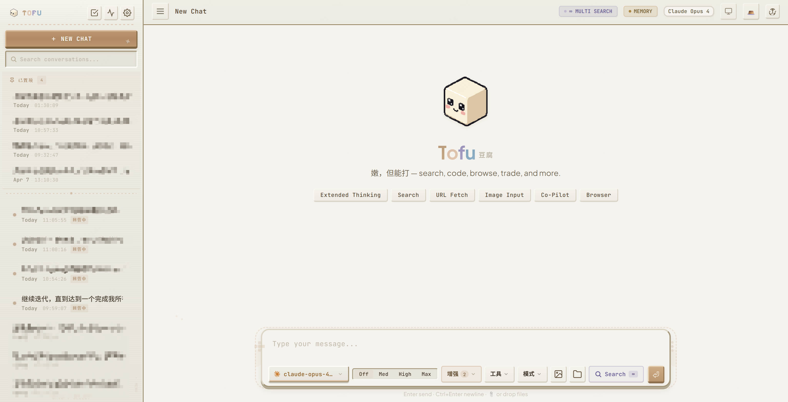
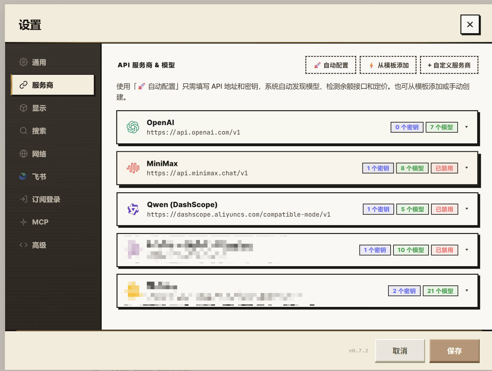
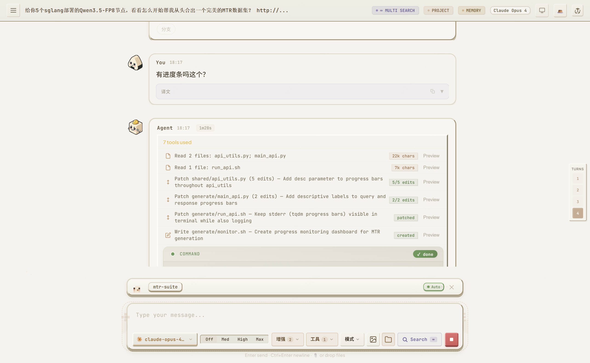

<p align="center">
  <br/>
  <br/>
  <sub>豆腐 — Self-Hosted AI Assistant</sub>
</p>

<p align="center">
  <a href="https://github.com/rangehow/ToFu/actions/workflows/ci.yml"></a>
  
  
  
  
  
</p>

<p align="center">
  <a href="README_CN.md">🇨🇳 中文文档</a>
</p>

<p align="center">
  
</p>

---

## What is Tofu?

Tofu is a **fully self-hosted AI assistant** you run with a single command. It connects to any OpenAI-compatible LLM and gives you a complete AI workspace — from simple Q&A to autonomous multi-step agents that can search the web, edit your codebase, control your browser, and collaborate as a team of specialist agents.

Everything runs on your machine. Your data never leaves your infrastructure. One `python server.py` and you're live.

---

## Quick Start

### One-Command Install (recommended)

**Linux / macOS:**
```bash
curl -fsSL https://raw.githubusercontent.com/rangehow/ToFu/main/install.sh | bash
```

**Windows (PowerShell):**
```powershell
irm https://raw.githubusercontent.com/rangehow/ToFu/main/install.ps1 | iex
```

**Or with Python directly** (any OS):
```bash
git clone https://github.com/rangehow/ToFu.git && cd ToFu
python install.py
```

This creates a dedicated conda environment, installs all dependencies from
conda-forge, and starts the server. Open **http://localhost:15000** when it's
ready.

> 🐍 **Conda-based installer.** The installer uses **conda-forge exclusively** —
> it auto-installs [Miniforge](https://github.com/conda-forge/miniforge) if no
> conda is present, updates conda first (outdated versions cause solver hangs),
> installs the `libmamba` solver, then creates a `tofu` env with Python 3.12
> and all dependencies (including `lxml`, `playwright`, `postgresql`). This
> avoids the GLIBC-mismatch trap that bites pip's manylinux wheels on older
> hosts (CentOS 7, glibc 2.17).

> 💾 **Database: zero-config.** Tofu uses **SQLite** by default (built into
> Python). If `postgresql` is available (the installer fetches it from
> conda-forge too), Tofu auto-bootstraps a rootless userspace PG instance for
> better concurrency with 100+ users. Force SQLite with
> `TOFU_DB_BACKEND=sqlite` (legacy `CHATUI_DB_BACKEND=sqlite` still works).

```bash
# Pre-configure API key and port
python install.py --api-key sk-xxx --port 8080

# Install only, don't launch
python install.py --no-launch

# Custom env name / Python version
python install.py --env tofu --python 3.12

# Skip conda self-update (not recommended)
python install.py --no-update-conda

# Destructive: remove the existing env and rebuild from scratch
python install.py --reset-env

# Use Docker instead
python install.py --docker
```

### Docker (zero dependencies)

```bash
git clone https://github.com/rangehow/ToFu.git && cd ToFu
docker compose up -d
```

Open **http://localhost:15000** — done. All data persists in Docker volumes.

<details>
<summary><strong>Manual Install</strong> (for full control)</summary>

**Prerequisites:** A recent `conda` (Miniforge strongly recommended). Nothing
else is needed — every runtime dependency (ripgrep, fd-find, PostgreSQL,
Chromium shared libs, lxml, trafilatura, playwright, …) is installed from
conda-forge so you never need `sudo` or system packages.

> 💡 **Why conda-forge for everything?** On older Linux hosts (CentOS 7 /
> glibc 2.17), pip's manylinux wheels for `lxml` et al. crash with
> `GLIBC_2.25 not found` at import time. conda-forge builds link against an
> older sysroot glibc and work everywhere.

```bash
# 1. Install Miniforge if you don't have conda yet
wget -O /tmp/Miniforge3.sh "https://github.com/conda-forge/miniforge/releases/latest/download/Miniforge3-Linux-x86_64.sh"
bash /tmp/Miniforge3.sh -b -p ~/miniforge3
~/miniforge3/bin/conda init bash && source ~/.bashrc
# (macOS: replace Linux-x86_64 with MacOSX-arm64 or MacOSX-x86_64.
#  Other platforms: see https://github.com/conda-forge/miniforge/releases)

# 2. Update conda FIRST — outdated conda is the #1 cause of solver hangs
conda update -n base -c conda-forge -y conda
conda install -n base -c conda-forge -y conda-libmamba-solver
conda config --set solver libmamba

# 3. Clone the repo
git clone https://github.com/rangehow/ToFu.git && cd ToFu

# 4. Create the env
conda create -n tofu -c conda-forge -y python=3.12
conda activate tofu

# 5. Install ALL dependencies from conda-forge (NO pip)
conda install -c conda-forge -y \
    flask 'flask-compress>=1.14' 'requests>=2.31' psutil \
    'trafilatura>=1.6' 'playwright>=1.40' pillow python-pptx 'lxml>=4.9' 'mcp>=1.0' \
    ripgrep fd-find \
    'postgresql>=16' 'psycopg2>=2.9'

# 6. Playwright Chromium (optional, for JS-rendered page fetching)
# On Linux also install shared libs (rootless, no sudo):
conda install -c conda-forge -y \
    atk-1.0 at-spi2-atk at-spi2-core alsa-lib \
    xorg-libxcomposite xorg-libxdamage xorg-libxfixes xorg-libxrandr \
    libxkbcommon nspr nss mesa-libgbm-cos7-x86_64
python -m playwright install chromium

# 7. Sanity check — if this prints a version without GLIBC errors, you're set
python -c "import lxml.etree, trafilatura; print('OK', lxml.__version__)"

# 8. Run
python server.py
```

> ⚠️ **Never mix pip and conda for these packages.** If a prior run left a
> pip-installed `lxml` wheel in your env, conda will no-op (version already
> satisfied) and the broken wheel keeps crashing. If that happens:
>
> ```bash
> pip uninstall -y lxml flask flask-compress requests psutil trafilatura \
>                  playwright pillow python-pptx mcp
> conda install -c conda-forge -y --force-reinstall <same package list>
> ```
>
> The one-command `install.sh` / `install.py` does this automatically.

</details>

> **Database auto-detection:** On first launch, Tofu tries PostgreSQL first
> (for best concurrency). If PG isn't available, it falls back to **SQLite**
> automatically — no action needed. PostgreSQL runs as a local userspace
> process (no `sudo`, no system service). Set `TOFU_DB_BACKEND=sqlite` to
> force SQLite (legacy `CHATUI_DB_BACKEND=sqlite` still works).

> **Missing packages?** If any dependency is missing, `server.py` auto-
> delegates to `bootstrap.py`, which first tries `conda install -c conda-forge`
> when running inside a conda env (avoiding the GLIBC trap), and falls back to
> LLM-guided `pip install` otherwise.

---

## Connect Your LLM

<p align="center">
  
</p>

Click **⚙️ Settings → 🔗 Providers** and add your API keys. Tofu works with any OpenAI-compatible API:

| Provider | Setup |
|---|---|
| OpenAI, Anthropic, Amazon Bedrock, Google Gemini, DeepSeek, Qwen, MiniMax, GLM, Doubao, Mistral, Grok, Baidu Qianfan, OpenRouter | Click **⚡ Add from template** — one click |
| Ollama, vLLM, or any local model server | Add as custom provider with your local endpoint |
| Azure OpenAI | Template available with deployment-specific base URL |

**Multiple keys per provider** — add several API keys and Tofu automatically rotates between them when one hits rate limits. Across providers, the smart dispatcher routes requests based on real-time latency scoring and error-rate tracking.

Or set environment variables for headless/Docker setups:
```bash
export LLM_API_KEY=sk-xxx
export LLM_BASE_URL=https://api.openai.com/v1
export LLM_MODEL=gpt-4o
```

---

## Features

### 💬 Chat with Any Model

<p align="center">
  
</p>

The core experience: pick a model from the dropdown, type a message, get a streaming response. But Tofu goes much further than a basic chat UI.

**When you want to try different models on the same question** — switch models mid-conversation. Each message remembers which model generated it, so you can compare outputs naturally. Branch any assistant message to explore alternative responses from different models or with different parameters, all in the same thread.

**When you're working in Chinese but need English sources** — enable auto-translation per conversation. Your Chinese questions are translated to English for the model, and the English response is translated back. The original is always preserved — click to toggle. For faster, cheaper translation, connect a dedicated [machine translation provider](#-machine-translation) instead of using the LLM.

**When conversations get long and you lose context** — Tofu's 3-layer compaction pipeline handles this automatically:
1. **Micro-compaction** (zero cost): old tool results are replaced with summaries, keeping only the recent "hot tail"
2. **Structural truncation**: thinking blocks, oversized arguments, and redundant screenshots are trimmed
3. **LLM summary** (force-triggered): when context pressure is high, a cheap model evaluates each turn for relevance and compresses accordingly

**When you want to organize your conversations** — create folders in the sidebar to group related threads. Drag conversations between folders, or leave them unfiled.

---

### 🔍 Web Search & Content Fetching

When the assistant needs current information — today's news, documentation updates, API references — it can search the web and read pages.

**How it works:** Enable the 🔍 toggle in the tool bar. The assistant searches across multiple engines in parallel (DuckDuckGo, Brave, Bing, SearXNG), deduplicates results, then fetches and extracts the most relevant pages. A content filter (LLM-powered, optional) strips navigation, ads, and boilerplate.

**When you paste a URL** — the assistant fetches it directly, handling HTML, PDFs, and plain text. For pages behind authentication, use the browser extension instead (see below).

**Configuration** — in **Settings → 🔍 Search & Fetch**:
- How many results to auto-fetch (default: 6)
- Per-page timeout and max characters
- Blocked domains the fetcher should never visit
- Whether to use the LLM content filter (disable for speed)

---

### 🛠️ Tool Calling & Autonomous Agents

This is where Tofu becomes more than a chatbot. When you enable tools, the assistant can take multi-step actions autonomously — searching the web, running code, editing files, generating images — chaining these together to solve complex tasks.

**Built-in tools:**
| Tool | What it does |
|---|---|
| `web_search` | Search the web (multi-engine parallel) |
| `fetch_url` | Read any URL (HTML, PDF, plain text) |
| `run_command` | Execute shell commands |
| `generate_image` | Create or edit images (Gemini, GPT-image) |
| `ask_human` | Pause and ask you a question mid-task |
| `list_conversations` / `get_conversation` | Reference past conversations |
| `create_memory` / `update_memory` / `delete_memory` | Save knowledge for future sessions |
| `check_error_logs` / `resolve_error` | Inspect and resolve errors in project logs |
| Browser tools | Control your browser (via extension) |
| Desktop tools | Control your local machine (via agent) |
| Project tools | Browse, search, edit any codebase |
| Scheduler tools | Create recurring automated tasks |
| Swarm tools | Spawn parallel sub-agents |

**When you need a quick answer with live data** — "What's the current price of NVDA?" The assistant searches, fetches the relevant page, and answers.

**When you need a multi-step workflow** — "Research the top 5 React state management libraries, compare them, and write a recommendation document." The assistant plans the steps, executes searches, reads documentation, and synthesizes the result — all autonomously.

**When the task is too complex for one pass** — enable **Endpoint mode** (Planner → Worker → Critic). A planner rewrites your request into a structured brief with acceptance criteria, a worker executes it, and a critic reviews against the checklist. If the result doesn't pass, the critic sends feedback and the worker iterates — up to 10 rounds.

**When something fails** — the assistant retries with exponential backoff. If the primary model fails entirely, it automatically falls back to a configured backup model and retries.

---

### 💻 Project Co-Pilot

Point Tofu at any codebase and it becomes a coding assistant that can read, search, edit, and run commands in your project.

**Getting started:** Click **Project** in the sidebar, enter the path to your codebase (e.g. `/home/you/myproject`). The assistant gains these tools:

| Tool | What it does |
|---|---|
| `list_dir` | Browse directory structure with file sizes and line counts |
| `read_files` | Read files (supports images, PDFs, Office docs, code — with line numbers) |
| `grep_search` | Search across files with ripgrep (regex, context lines, count mode) |
| `find_files` | Find files by glob pattern |
| `write_file` | Create or overwrite files |
| `apply_diff` | Surgical search-and-replace edits (batch mode for multiple edits) |
| `insert_content` | Add code before/after an anchor without replacing it |
| `run_command` | Execute shell commands in the project directory |

**When you need to understand a new codebase** — "Give me an overview of this project's architecture." The assistant explores the directory tree, reads key files, and maps out the structure.

**When you need to fix a bug** — "The login page shows a blank screen after submitting." The assistant greps for relevant code, reads the components, identifies the issue, and applies a fix with `apply_diff`.

**When you want safe experimentation** — every file modification is tracked per-conversation with full undo support. Click the undo button to roll back any changes the assistant made.

**Multi-root projects** — add multiple directories as roots (e.g. frontend + backend repos). The assistant resolves namespaced paths across all roots.

**Smart token management** — the `content_ref` mechanism lets the assistant write a previous tool result to a file without re-generating it, and `emit_to_user` ends a turn by pointing you to existing tool output instead of repeating it. This saves significant tokens on large files.

---

### 🤖 Multi-Agent Swarm

Some tasks are too big for a single agent. The swarm system lets a master orchestrator plan sub-tasks and delegate them to specialist agents running in parallel.

**When to use it:** "Refactor this microservice into 3 separate services, update the API docs, and write migration scripts." Instead of one agent doing everything sequentially, the master spawns parallel agents for each sub-task.

**How it works:**
1. The master LLM plans sub-tasks and assigns roles (coder, researcher, writer, reviewer…)
2. A **streaming DAG scheduler** launches agents as soon as their dependencies complete — no waiting for entire waves
3. Agents share data through an **artifact store** (key-value pairs visible to all agents)
4. As agents complete, the master reviews results and can spawn follow-up agents
5. Final results are synthesized into a coherent output

**Agent roles** — each agent gets role-specific system prompts, model tiers, and scoped tool access. A "researcher" agent gets search tools; a "coder" agent gets project tools; a "reviewer" gets read-only access.

**Rate limiting** — a shared semaphore prevents agents from overwhelming the LLM API with concurrent requests. Automatic exponential backoff on 429s.

---

### 🌐 Machine Translation

When you translate frequently and want faster, cheaper results — connect a dedicated machine translation provider instead of using the LLM for translation.

**How it works:** By default, Tofu uses a cheap LLM model for auto-translation (which understands context but is slower). When you configure a machine translation provider, all translation requests are routed directly to the MT API — typically **3–5× faster** and **10–100× cheaper** than LLM-based translation, with no prompt overhead.

**Setup:** Go to **Settings → 🌐 翻译 (Translation)**, enable machine translation, and choose a provider:

| Provider | Description | How to get API Key |
|---|---|---|
| **NiuTrans (小牛翻译)** | Chinese MT specialist, supports 300+ language pairs | [niutrans.com/cloud/overview](https://niutrans.com/cloud/overview) |
| **Custom** | Any compatible REST API | Enter your endpoint and credentials |

NiuTrans is the default provider with excellent Chinese↔English quality. Click **"申请 API Key"** in the settings card to register.

**Fallback behavior:**
- **No MT configured** → uses the cheap LLM model (default, works out of the box)
- **MT configured** → uses the MT API; if it fails, automatically falls back to LLM translation
- **Code block protection** → fenced (` ```...``` `) and inline (`` `...` ``) code blocks are extracted before translation and restored after, preventing MT from corrupting code

---

### 🔀 CLI Backend Switching

Already using **Claude Code** or **OpenAI Codex**? Tofu can act as a pure web frontend for them — you get Tofu's UI, conversation management, and persistence, while the external CLI handles all LLM calls and tool execution with its own authentication.

**Setup:**
```bash
# Install Claude Code
npm install -g @anthropic-ai/claude-code && claude auth login

# Or install Codex
npm install -g @openai/codex && codex auth login
```

Click the **backend selector** (🤖) in the top bar to switch. The UI automatically adapts — model selector and Tofu-specific features are hidden when using an external backend.

| Feature | Built-in (Tofu) | Claude Code | Codex |
|---------|:-:|:-:|:-:|
| Chat & streaming | ✅ | ✅ | ✅ |
| Web search | ✅ | ✅ (CC's) | ✅ (Codex's) |
| File operations | ✅ | ✅ (CC's) | ✅ (Codex's) |
| Code execution | ✅ | ✅ (Bash) | ✅ (exec) |
| Model selection | ✅ | — | — |
| Image generation | ✅ | ❌ | ❌ |
| Browser extension | ✅ | ❌ | ❌ |
| Multi-agent swarm | ✅ | ❌ | ❌ |

> The CLI must be installed on the same machine as the Tofu server. Each conversation remembers its backend.

---

### 🌐 Browser Extension

When you need the assistant to read pages that require login — internal dashboards, JIRA tickets, authenticated admin panels — the browser extension bridges your real browser session to Tofu.

**Setup:**
1. Go to `chrome://extensions` → Enable Developer Mode
2. Load unpacked → select the `browser_extension/` folder
3. Click the extension icon → enter your Tofu server URL

**What it can do:**

| Tool | Use case |
|---|---|
| `browser_list_tabs` | See all your open tabs |
| `browser_read_tab` | Extract text content (with optional CSS selector) |
| `browser_screenshot` | Capture a visual screenshot |
| `browser_navigate` | Open a URL |
| `browser_click` | Click elements by selector or text |
| `browser_type` | Type into input fields |
| `browser_execute_js` | Run custom JavaScript for data extraction |
| `browser_get_interactive_elements` | Discover clickable/typeable elements |
| `browser_get_app_state` | Access Vue/React internal state |

**When the page uses Canvas/SVG rendering** (charts, DAG diagrams) — DOM text extraction returns nothing. Use `browser_screenshot` for visual analysis, `browser_get_app_state` for data, or `browser_execute_js` for custom extraction.

**Multiple browsers** can connect simultaneously with independent command queues — useful if you have work and personal browser profiles.

---

### 🖥️ Desktop Agent

When you need the assistant to interact with your local machine beyond the browser — take full-screen screenshots, read/write local files, automate GUI clicks, manage clipboard.

**Setup:**
```bash
pip install pyautogui pillow psutil
python lib/desktop_agent.py --server http://your-server:15000 --allow-write --allow-exec
```

The agent connects to your Tofu server and exposes tools for file operations, clipboard, screenshots, GUI automation (pyautogui), and system info. All dangerous operations require explicit `--allow-write` / `--allow-exec` flags.

---

### 📄 Paper Reader (beta)

When you're reading research papers — arXiv PDFs, conference proceedings, internal whitepapers — Paper Reader turns Tofu into a dedicated research companion.

**How to use:** Click the **📄 Paper** button in the sidebar. The screen splits: **PDF on the left**, **chat + notes on the right**. Upload a PDF or paste an arXiv URL (`arxiv.org/abs/XXXX.XXXXX`) — Tofu fetches, parses, and indexes the full text so the assistant can answer questions grounded in the paper.

**What it does:**
- **Grounded Q&A** — ask "what's the ablation result in Table 3?" or "explain Section 4.2" — the assistant cites the specific passage it's drawing from
- **Paper library** — the left sidebar shows all papers you've read, grouped by date; switch between them without losing conversation context
- **Side-by-side reading** — scroll the PDF while chatting; the assistant sees the page you're on
- **Notes tab** — drop your own notes alongside the paper; they persist across sessions

> ⚠️ **Beta:** Paper Reader is actively being iterated on. Feedback welcome on [GitHub Issues](https://github.com/rangehow/ToFu/issues).

#### Optional: Layout-aware PDF parsing with Docling

The default PDF pipeline (`pymupdf4llm`) does a good job on most papers, but
struggles with **borderless tables** and **complex math formulas** that are
common in ML / theoretical CS papers. For those, Tofu can route through
[**Docling**](https://github.com/docling-project/docling) (IBM) — a layout-aware
model that uses TableFormer for tables and an internal equation model for math,
producing much cleaner Markdown.

**Trade-off:** Docling pulls in PyTorch + ~2 GB of model weights, so it's **opt-in**.

```bash
# At install time
./install.sh --with-docling
# Or:
python install.py --with-docling

# Or after the fact:
pip install docling --extra-index-url https://download.pytorch.org/whl/cpu
```

Then enable it by setting `PDF_TEXT_MODE=structured` in your `.env`, or
per-request via the form field `textMode=structured` on `/api/pdf/parse`.
If Docling isn't installed when `structured` is requested, the server falls
back to `pymupdf4llm` automatically — your uploads never break.

---

### 🖼️ Image Generation

When you need visual content — illustrations, diagrams, logos, edited photos — the assistant can generate images mid-conversation.

**How to use:** Enable the 🖼️ toggle in the tool bar and describe what you want. The assistant calls `generate_image` with a detailed prompt.

- **Create from scratch** — "Draw a minimalist logo of a mountain with a sunrise"
- **Edit existing images** — upload an image and say "change the background to a beach sunset"
- **Save to project** — specify `output_path` to save directly into your codebase
- **SVG conversion** — add `svg: true` to auto-trace the generated PNG into a scalable vector

Multi-model dispatch cycles across Gemini and GPT image models, automatically retrying on rate limits.

---

### 🔗 MCP (Model Context Protocol)

When you want to connect external tool servers — GitHub, databases, custom APIs — MCP bridges them into Tofu's tool system.

**How it works:** MCP servers run as subprocesses and communicate via stdio/SSE (JSON-RPC 2.0). Tofu translates their tools into OpenAI function-calling format, so the LLM can discover and invoke them alongside native tools.

**Setup:** Go to **Settings** or configure in `data/config/mcp_servers.json`:
```json
{
  "github": {
    "command": "npx",
    "args": ["-y", "@modelcontextprotocol/server-github"],
    "env": { "GITHUB_TOKEN": "ghp_xxx" }
  }
}
```

The assistant can then call tools like `mcp__github__create_issue`, `mcp__github__search_code`, etc. — any MCP-compatible server works.

---

### ☑️ Daily Reports & My Day

Click the **☑️ My Day** button in the sidebar to open your personal work journal — an LLM-powered daily dashboard.

**When you want to see what you accomplished today** — the LLM reads all your conversations for the day and clusters them into 5–15 coherent work streams (e.g. "Fix image rendering bug", "Deploy staging environment"), marking each as *done*, *in progress*, or *blocked*.

**When you need tomorrow's plan** — the LLM synthesizes 3–8 actionable TODO items from unfinished work. Each comes with a detailed prompt and recommended tool configuration. Click ▶ to launch any TODO as a new conversation, pre-filled and ready to go.

**Calendar view** — month-at-a-glance with per-day conversation counts and cost heatmap. Click any date to view or generate its report.

**To-do management** — uncompleted TODOs carry forward to the next day. Add manual TODOs, toggle done/undone, or launch them as conversations. Cost tracking shows per-day and per-conversation spend in CNY.

**Auto-backfill** — a background scheduler generates yesterday's report on server boot if it's missing, and again daily at midnight.

---

### 🕐 Scheduled Tasks

When you need something to run automatically — daily data pulls, periodic health checks, recurring reports — create a proactive agent that runs on a schedule.

**How to use:** Enable the 🕐 Scheduler toggle and ask: "Run a health check on my API every 6 hours" or "Every morning at 9am, summarize overnight GitHub issues." The assistant creates a cron-like task.

**Task types:** Shell commands, Python scripts, or LLM prompts — all with full tool access.

**Manage tasks:** Click the **SCHEDULER** badge in the top status bar to see all active proactive agents and their recent run logs.

---

### 🐦 Feishu (Lark) Bot

When your team communicates in Feishu and you want AI assistance directly in group chats — Tofu connects as a Feishu bot via WebSocket.

**Setup:**
1. Create an app at [open.feishu.cn](https://open.feishu.cn/app), enable Bot capability
2. Go to **Settings → 🐦 Feishu** → enter App ID and App Secret
3. The bot auto-connects on server restart

**Features:** Multi-turn conversations with full tool support (search, code, project), slash commands for model/mode switching, and conversation management — all within Feishu's native chat interface.

---

### 🧠 Memory System

When the assistant discovers something useful — a bug pattern, a project convention, your preferred coding style — it can save that knowledge as a **memory** for future sessions.

**How it works:** Memories are Markdown files stored in `.chatui/skills/` (project-scoped) or `.chatui/skills/global/` (all projects). The assistant creates them proactively or when you ask. In future conversations, relevant memories are automatically loaded into context.

**Tools:** `create_memory`, `update_memory`, `delete_memory`, `merge_memories` — the assistant manages its own knowledge base across sessions.

**When to use:** "Remember that our API always returns snake_case" — the assistant saves this convention and applies it in all future code generation for this project.

---

### 🔌 Conversation Branching

When you want to explore a different direction without losing the current thread — branch any assistant message.

**How it works:** Click the branch icon on any assistant message. A new branch opens inline, continuing from that point with its own independent history. Multiple branches can stream in parallel. Each branch can use a different model or parameters.

**Use cases:**
- Compare how different models answer the same question
- Try an alternative approach without losing the current one
- Let one branch research while another branch implements

---

## Settings Reference

All configuration is done through the **⚙️ Settings** panel (top-right gear icon). Changes save instantly — no restart needed.

| Tab | What you configure |
|---|---|
| **⚙️ General** | Theme (Dark/Light/Tofu), temperature, max tokens, thinking depth, system prompt |
| **🔗 Providers** | API keys, endpoints, model lists, multi-key rotation, auto-discovery |
| **📦 Display** | Which models appear in dropdowns, default model, fallback model |
| **🔍 Search & Fetch** | Result count, timeouts, character limits, blocked domains, content filter |
| **🌐 Translation** | Machine translation provider (NiuTrans / Custom), API key, endpoint |
| **🌐 Network** | HTTP/HTTPS proxy, bypass domains |
| **🐦 Feishu** | App credentials, default project, allowed users |
| **`</>` Advanced** | Price overrides, cache management, server info |

### Environment Variables (fallback)

For headless/Docker setups, you can configure via environment variables instead of the Settings UI. Copy the template and edit:

```bash
cp .env.example .env
vim .env   # fill in your values
```

The `.env.example` file documents all supported variables. Key ones:

| Variable | Description | Default |
|---|---|---|
| `LLM_API_KEYS` | Comma-separated API keys | *(none)* |
| `LLM_BASE_URL` | API endpoint | `https://api.openai.com/v1` |
| `LLM_MODEL` | Default model | `gpt-4o` |
| `PORT` | Server port | `15000` |
| `BIND_HOST` | Bind address | `0.0.0.0` |
| `TUNNEL_TOKEN` | Auth token for public tunnel access | *(disabled)* |
| `TRADING_ENABLED` | Enable trading module (`1`/`0`) | `0` |
| `PDF_TEXT_MODE` | Default PDF text-extract strategy: `rich` (pymupdf4llm, default), `structured` (Docling; requires `pip install docling`), `fast` | `rich` |
| `PDF_VLM_BATCH_PAGES` | Pages per VLM call when VLM parsing is used (1–16) | `4` |
| `PDF_VLM_MAX_WORKERS` | Cap on concurrent VLM calls (useful on shared keys to avoid 429 storms) | unlimited |

> **Priority:** Settings UI > `.env` file > system environment > defaults. You can also `export` variables directly — `.env` is just a convenience.

---

## Project Structure

```
├── server.py                  Flask app entry, middleware, logging
├── bootstrap.py               Auto-dependency repair (LLM-guided)
├── index.html                 Main chat UI (single-page app)
│
├── lib/                       Core libraries
│   ├── agent_backends/        CLI backend switching (builtin/Claude Code/Codex)
│   ├── llm_client.py          LLM API client (streaming, retry)
│   ├── llm_dispatch/          Multi-key multi-model smart dispatcher
│   ├── database/              Dual backend — SQLite default, PostgreSQL auto-bootstrap
│   ├── tasks_pkg/             Task orchestration & context compaction
│   │   ├── orchestrator.py    Main LLM ↔ tool loop
│   │   ├── executor.py        Tool execution engine
│   │   ├── endpoint.py        Planner → Worker → Critic loop
│   │   └── compaction.py      3-layer context compaction
│   ├── tools/                 Tool definitions & schemas
│   ├── swarm/                 Multi-agent orchestration
│   ├── fetch/                 Content fetching & extraction
│   ├── search/                Multi-engine web search
│   ├── browser/               Browser extension bridge
│   ├── project_mod/           Project co-pilot (scan, edit, undo)
│   ├── memory/                Memory accumulation system
│   ├── mcp/                   Model Context Protocol bridge
│   ├── feishu/                Feishu bot integration
│   ├── scheduler/             Task scheduling (cron, proactive agents)
│   ├── image_gen.py           Image generation (multi-model dispatch)
│   ├── mt_provider.py         Machine translation providers (NiuTrans, custom)
│   ├── desktop_agent.py       Desktop automation agent
│   └── ...
│
├── routes/                    Flask Blueprints (21 API modules)
├── static/                    CSS, JS, icons
├── browser_extension/         Chrome extension (Manifest V3)
├── tests/                     Test suite (unit, API, E2E)
└── data/                      Runtime data (git-ignored)
```

---

## Platform Support

| Feature | Linux | macOS | Windows |
|---|:---:|:---:|:---:|
| Core chat & tools | ✅ | ✅ | ✅ |
| SQLite (default, zero-config) | ✅ | ✅ | ✅ |
| PostgreSQL auto-bootstrap (optional) | ✅ | ✅ | ✅ |
| Project co-pilot | ✅ | ✅ | ✅ |
| Shell commands | ✅ | ✅ | ✅ (`cmd.exe`) |
| Desktop agent | ✅ | ✅ | ✅ |
| Browser extension | ✅ | ✅ | ✅ |

Smoke test: `python debug/test_cross_platform.py`

---

## Testing

```bash
# All tests
python tests/run_all.py

# Individual suites
python -m pytest tests/test_backend_unit.py
python -m pytest tests/test_api_integration.py
python -m pytest tests/test_visual_e2e.py
```

---

## Security

- **No secrets in source** — all credentials loaded from environment variables or Settings UI
- **Single-user mode** — no multi-tenant auth; deploy behind a VPN or reverse proxy for production
- **Tool execution** — the assistant can run shell commands and edit files; dangerous patterns are blocked, but use with appropriate caution
- **Desktop agent** — requires explicit `--allow-write` / `--allow-exec` flags

---

## Contributing

See [CONTRIBUTING.md](CONTRIBUTING.md) for the full guide. Quick version:

1. Fork → feature branch
2. `python healthcheck.py && python tests/run_all.py`
3. Submit a pull request

---

## License

MIT
