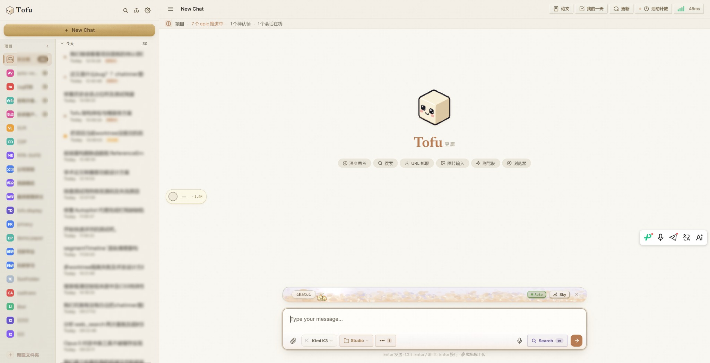
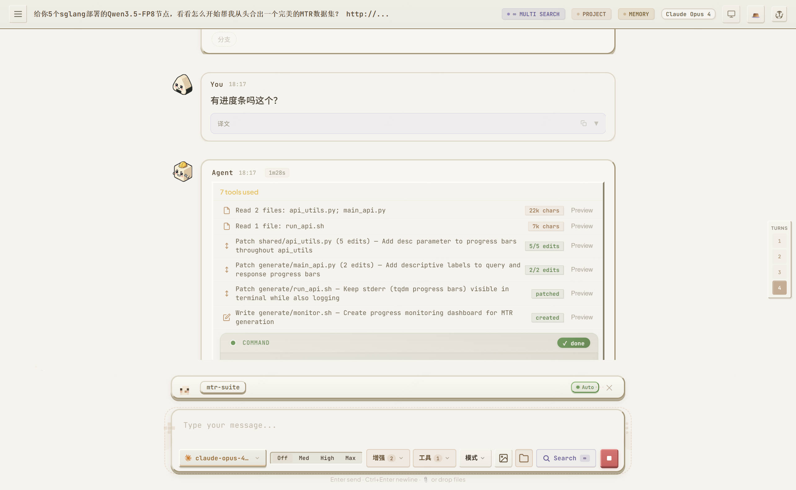

<p align="center">
  <br/>
  <br/>
  <sub>豆腐 — 自托管 AI 助手</sub>
</p>

<p align="center">
  <a href="https://github.com/rangehow/ToFu/actions/workflows/ci.yml"></a>
  
  
  
  
  
</p>

<p align="center">
  <a href="README.md">🇬🇧 English</a>
</p>

<p align="center">
  
</p>

---

## Tofu 是什么？

Tofu 是一个**完全自托管的 AI 助手**，一条命令即可启动。它可以连接任何 OpenAI 兼容的大模型 API，为你提供一个完整的 AI 工作空间 —— 从简单的问答，到能自主搜索网页、编辑代码、读论文、操控浏览器、多智能体协作的全能智能体。

一切都运行在你自己的机器上，数据不会离开你的基础设施。一条命令，开箱即用。

**Tofu 有何不同：**

- **一条命令，全部搞定** —— 安装器会为你装好运行时、依赖、数据库和浏览器引擎。不强制 Docker（但支持），不用手动建库，不用手改配置文件。
- **想用什么模型都行** —— OpenAI、Anthropic、Gemini、DeepSeek、Qwen、GLM，Ollama/vLLM 本地模型，甚至直接登录你已有的 **Claude Pro/Max / ChatGPT 订阅**。加多个密钥，Tofu 会自动轮换与负载均衡。
- **是真正的智能体，不只是聊天框** —— 它能自主跑多步任务：搜索、阅读、写代码、跑命令、生成图片，并用 Planner → Worker → Critic 循环自我检查。
- **完全属于你** —— 自托管、MIT 许可、无遥测。你的对话、密钥和文件都留在你自己的基础设施上。
- **一切皆 API** —— UI 里的每个功能都是有文档的 HTTP 接口，可以脚本化或接入其它工具（见 [无头 API](#无头-apiheadless-api)）。

> **想从 AI 智能体或编码助手驱动 Tofu？** 本文档是写给*人*看的。另有一套面向机器的材料 —— 见底部的 [面向 AI 智能体与开发者](#面向-ai-智能体与开发者)。

---

## 快速开始

挑一个匹配你系统的命令运行，结束后服务器会跑在 **http://localhost:15000**。

| 系统 | 怎么做 |
|---|---|
| **Windows** | 从[最新 Release](https://github.com/rangehow/ToFu/releases/latest)下载 **`Tofu-Setup-x.y.z-win64.exe`**，双击运行。 |
| **Linux / macOS** | `curl -fsSL https://raw.githubusercontent.com/rangehow/ToFu/main/install.sh \| bash` |
| **Docker** | `git clone https://github.com/rangehow/ToFu.git && cd ToFu && docker compose up -d` |

> **macOS —— 想要点开即用的桌面应用？** 不走上面的 `install.sh`，可到[最新 Release](https://github.com/rangehow/ToFu/releases/latest)下载 `.dmg`，并按你的芯片选择：
> Apple 芯片（M1/M2/M3…）选 **`Tofu-*-macos-arm64.dmg`**，Intel Mac 选 **`Tofu-*-macos-x86_64.dmg`**。

就这一步。每个方式都会自动处理运行时、依赖、数据库、浏览器引擎，并启动服务器 —— 无需任何参数，无需后续操作。数据库默认使用 **SQLite**（零配置）；仅当你需要 PostgreSQL 的更高并发（100+ 用户）时，才在 Linux/macOS 命令后加 `--with-postgres`。

> 想预设 API 密钥、改端口、或安装失败需要恢复？所有可选参数和故障排查方案都在 **[docs/INSTALL.md](docs/INSTALL.md)**。

---

## 连接你的大模型

<p align="center">
  
</p>

点击 **⚙️ 设置 → 🔗 服务商**，添加你的 API 密钥。Tofu 支持任何 OpenAI 兼容的 API：

| 服务商 | 配置方式 |
|---|---|
| OpenAI、Anthropic、Amazon Bedrock、Google Gemini、DeepSeek、Qwen、MiniMax、GLM、Doubao、Mistral、Grok、百度千帆、OpenRouter | 点击 **⚡ 从模板添加** —— 一键完成 |
| Ollama、vLLM 或任何本地模型服务 | 添加为自定义服务商，填入你的本地端点 |
| Azure OpenAI | 模板可用，填入部署专属的 Base URL |

**同一服务商多个密钥** —— 添加多个 API 密钥，当某个密钥触发限速时自动轮换到下一个。跨服务商的智能调度器会根据实时延迟评分和错误率追踪来路由请求。

或者通过环境变量配置（适用于无界面/Docker 部署）：
```bash
export LLM_API_KEY=sk-xxx
export LLM_BASE_URL=https://api.openai.com/v1
export LLM_MODEL=gpt-4o
```

---

## 无头 API（Headless API）

UI 里能做的事情同样以有文档的 HTTP API 形式暴露，你可以从脚本、Agent 或你自己的应用里驱动 Tofu，不需要渲染 Web UI。

**挂载点：**

| 前缀 | 接口面 |
|---|---|
| `/api/v1/*` | Tofu 原生 —— 与 UI 功能打平（chat、conversations、tasks、agents、capabilities、keys、usage、billing …） |
| `/v1/...` | OpenAI 兼容 —— `chat/completions`、`models`、`embeddings`（OpenAI SDK 可直接点过来） |
| `/v1/messages` | Anthropic 兼容 —— Messages API（Anthropic SDK 可直接点过来） |
| `/metrics` | Prometheus 曝露格式（限 admin 作用域） |

**自描述：**`/api/openapi.json` 和 `/api/openapi.yaml`（OpenAPI 3.1）、Swagger UI 位于 `/api/docs`、ReDoc 位于 `/api/redoc`。

在 **设置 → 🔑 API Keys** 中**管理密钥**：创建、划分作用域（`chat`/`admin` 等）、设置每密钥的 RPM 和 TPD 限额、吊销、查看每密钥 30 天使用量图表。POST 请求支持 Idempotency-Key（24 小时缓存，按身份加盐）。所有响应都会返回标准的限速头（`X-RateLimit-*`、`Retry-After`）。

**客户端 SDK** 在 [`clients/`](clients/) 下：

```bash
# Python —— 同步的 `Tofu` 类 + `tofu` 命令行
cd clients/python && pip install -e ".[cli]"
export TOFU_API_KEY=tofu_admin_xxx TOFU_BASE_URL=http://localhost:15000
tofu chat "你好"

# TypeScript —— Node 18+、浏览器、Cloudflare Workers、Vercel Edge、Deno、Bun
cd clients/typescript && npm install
```

也可直接用任意 OpenAI / Anthropic SDK，只需将 Base URL 指向你的 Tofu 服务、API Key 填 `tofu_admin_*` 即可。

---

## 多租户中继站（付费模式）

当 `auth_mode=multi-user` 时，Tofu 变为一个**付费的 AI 中继站** —— 一份自托管部署服务多个用户，每个用户一个钱包，费用以你上游的 LLM 成本为准计费。

**切换该模式后自动点亮的能力**（在 `open`/`private` 下为 no-op）：

- **每用户钱包**，单位为微点数（1 信用点 = 1,000,000 µ ≈ 美元 0.001），以**追加写账本**为唯一真相源 —— 全部整数运算，无浮点误差。
- **原子预扣 / 清算**：每个聊天请求先做预扣，余额不足直接返回 402；任务结束后按实际 token 用量清算；后台清扫器每 30 分钟释放过期的未清算预扣。
- **面向用户的页面** —— `/login`、`/signup`、`/dashboard`（钱包、密钥、使用量、文档、账号页签）。注册准入策略与迎新信用在 `data/config/relay.json` 中配置。
- **支付** —— Stripe Webhook 与支付宝异步通知，按 `(provider, provider_id)` 幂等。凭证在 `data/config/payments.json` 中配置。
- **兑换码** —— 批量生成，发给用户，换入钱包。
- **价格表** —— 每模型的单价（输入 / 输出 / 缓存）从 `data/config/pricing.json` 热加载，支持按模型族前缀回退与管理员可调的加价率。
- **管理控制台** —— 一个独立的 **`/admin`** 面板（Users、Pricing、Redeem Codes、Payments），仅在 multi-user 模式下、以 `admin` 作用域密钥才能访问。

上述能力的实现全部位于 `lib/billing/` 与 `routes/api_v1/billing.py`；切回 `open` / `private` 后表便为空、面向用户的页面不再提供，闸道行为与上一节描述一致。

---

## 功能详解

### 💬 与任何模型对话

<p align="center">
  
</p>

核心体验：从下拉菜单选择模型，输入消息，获得流式回复。但 Tofu 远不止一个基础对话框。

**想用不同模型试同一个问题？** 随时在对话中切换模型。每条消息都记住了生成它的模型，方便你自然地对比输出。你还可以对任意助手回复进行分支，用不同模型或参数探索替代答案，所有分支都在同一个对话线程中。

**用中文提问但需要英文资料？** 开启按对话的自动翻译。你的中文问题会被翻译成英文发给模型，英文回复再翻译回中文。原文始终保留，点击即可切换查看。想要更快更便宜的翻译？可以接入专用的[机器翻译服务商](#-机器翻译)来替代 LLM。

**对话太长，上下文快爆了？** Tofu 的 3 层上下文压缩流水线自动处理：
1. **微压缩**（零成本）：旧的工具调用结果被替换为摘要，只保留最近的"热尾巴"
2. **结构化截断**：思考过程块、过大的参数、冗余截图被裁剪
3. **LLM 摘要**（强制触发）：当上下文压力过高时，一个廉价模型评估每轮对话的相关性并据此压缩

**想整理你的对话？** 在侧边栏创建文件夹来分组相关对话。可以在文件夹之间拖拽，也可以不归类。

**想按顺序读懂它的思路？** 已完成的多工具回复会以*交错时间线*渲染：每个工具调用就近显示在引出它的思考与说明文字旁边，让你按操作实际发生的顺序阅读，而不是"所有思考 / 所有工具 / 所有正文"三大块。默认开启，可在 **设置 → 通用 → "按工具内联时间线"** 中切换。

**当对话变长时** —— 一个**上下文健康条**显示你已用掉多少模型窗口，Tofu 会自动**压缩**较早的轮次，让对话不撞上限继续进行。你可以打开**压缩查看器**，看清究竟压缩了哪些内容，不会有"丢东西"的感觉。

---

### 🎙️ 语音输入（语音转文字）

当打字比说话慢 —— 直接对着输入框口述。

**使用方法：** 点击输入框旁的**麦克风按钮**，允许麦克风权限，说话，再点一次停止。你的语音会被转写并插入到光标处 —— **不会自动发送**，你可以先审阅、编辑再发。这是听写，不是语音对话。

**只有**当浏览器支持录音*且*配置了语音转文字模型时，麦克风按钮才会出现，否则保持隐藏。启用方式：在 **设置 → 服务商** 添加一个模型带 `transcription`（或 `audio_chat`）能力的服务商：

| 服务商 | 模型 |
|---|---|
| **OpenAI** | `gpt-4o-transcribe`、`gpt-4o-mini-transcribe`、`whisper-1` |
| **Groq** | `whisper-large-v3-turbo`、`whisper-large-v3`（快、便宜） |
| **全模态对话模型** | Gemini / LongCat 等，走 `audio_chat` |

可选环境变量：`TOFU_AUDIO_MAX_BYTES`（默认 25 MB）、`TOFU_AUDIO_MAX_DURATION_S`（默认 600 秒）。没有单独的语音设置页 —— 是否可用完全取决于所配置的模型。

---

### 🔍 网页搜索与内容抓取

当助手需要实时信息 —— 今天的新闻、文档更新、API 参考 —— 它可以搜索网页并阅读页面。

**工作原理：** 在工具栏启用 🔍 开关。助手会并行搜索多个引擎（DuckDuckGo、Brave、Bing、SearXNG），去重后抓取最相关的页面。可选的 LLM 内容过滤器会自动去除导航栏、广告和模板代码。

**直接粘贴 URL？** 助手直接抓取，支持 HTML、PDF 和纯文本。如果页面需要登录认证，使用浏览器插件代替（见下文）。

**配置** —— 在 **设置 → 🔍 搜索与抓取** 中：
- 自动抓取的结果数量（默认：6）
- 每页超时和最大字符数
- 屏蔽域名列表
- 是否启用 LLM 内容过滤（关闭可加速）

---

### 🛠️ 工具调用与自主智能体

这是 Tofu 超越普通聊天机器人的地方。启用工具后，助手可以自主执行多步操作 —— 搜索网页、运行代码、编辑文件、生成图片 —— 将这些串联起来解决复杂任务。

**内置工具：**
| 工具 | 功能 |
|---|---|
| `web_search` | 搜索网页（多引擎并行） |
| `fetch_url` | 读取任意 URL（HTML、PDF、纯文本） |
| `run_command` | 执行 Shell 命令 |
| `generate_image` | 创建或编辑图片（Gemini、GPT-image） |
| `ask_human` | 任务中途暂停并向你提问 |
| `list_conversations` / `get_conversation` | 引用过往对话 |
| `create_memory` / `update_memory` / `delete_memory` | 保存知识供未来使用 |
| `check_error_logs` / `resolve_error` | 检查和解决项目日志中的错误 |
| 浏览器工具 | 操控你的浏览器（通过插件） |
| 桌面工具 | 操控你的本地机器（通过代理） |
| 项目工具 | 浏览、搜索、编辑任意代码库 |
| 定时任务工具 | 创建周期性自动化任务 |
| Swarm 工具 | 启动并行子智能体 |

**需要基于实时数据的快速回答？** —— "英伟达今天的股价是多少？"助手搜索、抓取相关页面并回答。

**需要多步骤工作流？** —— "调研排名前 5 的 React 状态管理库，做个对比，写一份推荐文档。"助手会规划步骤、执行搜索、阅读文档并综合结果 —— 全程自主完成。

**任务太复杂，一次搞不定？** —— 启用 **终端模式**（Planner → Worker → Critic）。规划者将你的需求改写为结构化简报并附上验收标准，执行者执行，审查者对照清单审查。如果结果不通过，审查者提反馈让执行者迭代 —— 最多 10 轮。

**出错了怎么办？** —— 助手会以指数退避策略自动重试。如果主模型完全失败，它会自动切换到配置的备选模型继续执行。

---

### 💻 项目协作（Co-Pilot）

将 Tofu 指向任意代码库，它就变成了一个能读取、搜索、编辑和执行命令的编程助手。

**开始使用：** 点击侧边栏的 **Project**，输入代码库路径（例如 `/home/you/myproject`）。助手将获得以下工具：

| 工具 | 功能 |
|---|---|
| `list_dir` | 浏览目录结构，含文件大小和行数 |
| `read_files` | 读取文件（支持图片、PDF、Office 文档、代码 —— 带行号） |
| `grep_search` | 使用 ripgrep 跨文件搜索（正则、上下文行、计数模式） |
| `find_files` | 按通配符模式查找文件 |
| `write_file` | 创建或覆盖文件 |
| `apply_diff` | 精确的搜索替换编辑（支持批量多文件编辑） |
| `insert_content` | 在锚点前后添加代码，不替换原内容 |
| `run_command` | 在项目目录中执行 Shell 命令 |

**想快速了解一个新代码库？** —— "给我概述一下这个项目的架构。"助手会浏览目录树、阅读关键文件，梳理出整体结构。

**需要修 Bug？** —— "登录页提交后白屏了。"助手会 grep 相关代码、阅读组件、定位问题，然后用 `apply_diff` 修复。

**想安全地实验？** —— 每次文件修改都按对话跟踪，支持完整撤销。点击撤销按钮即可回滚助手做的任何改动。

**多项目根目录** —— 可添加多个目录作为根（例如前端 + 后端仓库）。助手通过命名空间在所有根目录之间解析路径。

**智能 Token 管理** —— `content_ref` 机制让助手可以将之前的工具结果直接写入文件而无需重新生成。这在处理大文件时能节省大量 Token。

---

### 🧩 项目大脑（Project Brain）—— 让同一项目的多个对话协同起来

当你在同一个项目上开了多个对话，**项目大脑**让它们像一个协同的团队一样工作，而不是各自为战、彼此健忘的聊天。每个对话都能看到其它对话在做什么、共享同样的目标和决策、避免互相踩踏 —— 项目甚至能自主认领并推进待办工作，而这一切始终对你完全可见、可控。

**如何使用：** **只要对话处于项目模式**（挂到某个项目目录）就**自动生效** —— 没有开关。你通过项目栏打开的**项目大脑面板**（实时活动、章程、看板、状态几个页签）来观察和引导它，协作栏里还有一行状态标题。唯一需要*你*的地方：智能体只能*提议*修改共享章程 —— 由你点击 **提交** 或 **拒绝**。

| 能力 | 它给你什么 |
|---|---|
| **章程（Charter）** | 一份共享的北极星文档 + 每个对话都遵循的既定决策。改动需人工批准。 |
| **看板与 Epic** | 一块可认领的工作流看板，让各对话分工、不重复劳动。 |
| **活动流** | 每个对话此刻在做什么的实时脉搏。 |
| **对话间消息** | 一个对话可以给另一个发出建议式提醒 —— 有限速、绝不打断进行中的工作。 |
| **路径租约** | 一个对话可以预定它正在编辑的文件，让其它对话先让开，避免编辑冲突。 |
| **状态通道** | 向项目询问"我们进展如何？有没有跑偏？"并得到综合回答，外加一份大脑会持续复查的关注清单。 |
| **自主调度** | 空闲项目会自动认领并启动就绪、未被阻塞的工作，无需交接。 |

---

### 🤖 多智能体集群（Swarm）

有些任务大到单个智能体难以胜任。Swarm 系统让一个主编排器规划子任务，并将它们分派给并行运行的专家智能体。

**什么时候用：** "把这个微服务拆分成 3 个独立服务，更新 API 文档，写迁移脚本。"与其让一个智能体按顺序做完所有事，主编排器会为每个子任务启动并行智能体。

**工作原理：**
1. 主 LLM 规划子任务并分配角色（编码者、研究者、写作者、审查者……）
2. **流式 DAG 调度器**在依赖完成后立即启动智能体 —— 不等待整波完成
3. 智能体通过**产出物仓库**（所有智能体可见的键值对）共享数据
4. 智能体完成后，主编排器审查结果并可启动后续智能体
5. 最终结果被综合为连贯的输出

**智能体角色** —— 每个智能体获得角色专属的系统提示词、模型层级和限定的工具访问权限。"研究者"有搜索工具；"编码者"有项目工具；"审查者"只有只读权限。

**限速** —— 共享信号量防止智能体用并发请求压垮 LLM API。遇到 429 错误时自动指数退避。

---

### 🌐 机器翻译

当你频繁使用翻译功能，希望更快更省钱 —— 接入专用的机器翻译服务商，替代 LLM 翻译。

**工作原理：** 默认情况下，Tofu 使用廉价 LLM 模型进行自动翻译（能理解上下文，但速度较慢）。配置机器翻译服务商后，所有翻译请求直接走 MT API —— 通常比 LLM 翻译**快 3–5 倍**、**便宜 10–100 倍**，且没有 Prompt 开销。

**配置方法：** 打开 **设置 → 🌐 翻译**，启用机器翻译，选择服务商：

| 服务商 | 说明 | 获取 API Key |
|---|---|---|
| **小牛翻译（NiuTrans）** | 中文机器翻译专家，支持 300+ 语言对 | [niutrans.com/cloud/overview](https://niutrans.com/cloud/overview) |
| **自定义** | 任何兼容的 REST API | 填入你的端点和凭证 |

小牛翻译是默认服务商，中英翻译质量出色。在设置卡片中点击 **"申请 API Key"** 即可注册。

**回退机制：**
- **未配置 MT** → 使用廉价 LLM 模型（默认，开箱即用）
- **已配置 MT** → 使用 MT API；如果失败，自动回退到 LLM 翻译
- **代码块保护** → 翻译前自动提取围栏代码块（` ```...``` `）和行内代码（`` `...` ``），翻译后还原，防止 MT 破坏代码

---

### 🔀 订阅登录（Claude Pro/Max · ChatGPT）

已经在为 **Claude Pro/Max** 或 **ChatGPT** 付费订阅？直接用它登录，Tofu 就把该订阅当作一个模型服务商使用 —— 无需单独的 API 密钥，计费走你已有的订阅套餐。

**使用方法：** 打开 **设置 → 服务商**，点击 **登录 Claude** / **登录 ChatGPT**。Tofu 会走一遍 PKCE OAuth 流程（`lib/oauth/`），保存 token，并由 `lib/oauth/outbound.py` 把已登录的订阅桥接进一个受管理的服务商 slot —— 每次请求时解析成实时 token 加上所需的客户端身份请求头。此后该订阅就与调度器里的其它服务商一样（slot 轮换、回退、延迟评分都适用）。

- **Claude** 请求走 Anthropic Messages API，并带上 Claude-Code 身份请求头。
- **ChatGPT（Codex）** 请求会自动转换为 Responses API 格式。

> 这是一个正常的调度内服务商，**不是** CLI 子进程。（早期的 CLI 子进程式"后端切换"机制 —— `lib/agent_backends/` —— 已于 2026-06 移除，改为这个更简单的"订阅即服务商"路径。）

---

### 🌐 浏览器插件

当你需要助手阅读登录后才能看的页面 —— 内部仪表盘、JIRA 工单、需要认证的管理后台 —— 浏览器插件可以桥接你真实的浏览器会话到 Tofu。

**安装：**
1. 打开 `chrome://extensions` → 启用开发者模式
2. 加载已解压的扩展程序 → 选择 `browser_extension/` 目录
3. 点击插件图标 → 输入你的 Tofu 服务器地址

**可以做什么：**

| 工具 | 用途 |
|---|---|
| `browser_list_tabs` | 查看你所有打开的标签页 |
| `browser_read_tab` | 提取文本内容（可选 CSS 选择器） |
| `browser_screenshot` | 截取页面截图 |
| `browser_navigate` | 打开一个 URL |
| `browser_click` | 通过选择器或文本点击元素 |
| `browser_type` | 在输入框中输入文字 |
| `browser_execute_js` | 运行自定义 JavaScript 提取数据 |
| `browser_get_interactive_elements` | 发现可点击/可输入的元素 |
| `browser_get_app_state` | 访问 Vue/React 内部状态 |

**页面使用 Canvas/SVG 渲染（图表、DAG 图等）？** DOM 文本提取会返回空内容。用 `browser_screenshot` 做视觉分析，`browser_get_app_state` 获取数据，或 `browser_execute_js` 自定义提取。

**多个浏览器**可以同时连接，拥有独立的命令队列 —— 适合你有工作和个人不同浏览器配置文件的场景。

---

### 🖥️ 桌面代理

当你需要助手超越浏览器与本地机器交互 —— 全屏截图、读写本地文件、自动化 GUI 点击、管理剪贴板。

**安装：**
```bash
pip install pyautogui pillow psutil
python lib/desktop_agent.py --server http://your-server:15000 --allow-write --allow-exec
```

代理连接到你的 Tofu 服务器，提供文件操作、剪贴板、截图、GUI 自动化（pyautogui）和系统信息等工具。所有危险操作需要显式启用 `--allow-write` / `--allow-exec` 标志。

---

### 📄 论文阅读模式（Beta）

阅读科研论文 —— arXiv PDF、会议论文集、内部白皮书 —— Paper Reader 把 Tofu 变成一个専用的科研阅读伙伴。

**使用方法：** 点击侧边栏的 **📄 Paper** 按钮。页面分屏：**左侧 PDF、右侧对话 + 笔记**。上传 PDF 或粘贴 arXiv 链接（`arxiv.org/abs/XXXX.XXXXX`） —— Tofu 会抓取、解析、索引全文，令助手能基于论文内容精准回答。

**能做什么：**
- **有据可依的问答** —— “表 3 的消融实验结果是什么？”或“解释 4.2 节”，助手会引用具体段落
- **论文库** —— 左侧侧边栏展示你读过的所有论文，按时间分组；切换论文不丢失上下文
- **并排阅读** —— 滚动 PDF 的同时聊天；助手可感知你当前所在页面
- **笔记面板** —— 在论文旁边记录你自己的笔记，跨会话持久保存

> ⚠️ **Beta：** 论文阅读模式正在持续迭代中，欢迎在 [GitHub Issues](https://github.com/rangehow/ToFu/issues) 反馈。

#### 可选：使用 Docling 进行版面感知的 PDF 解析

默认的 PDF 解析管线（`pymupdf4llm`）在大多数论文上表现良好，但在 ML / 理论 CS 论文中常见的**无框表格**和**复杂数学公式**上效果较差。对于这类论文，Tofu 可以路由到
[**Docling**](https://github.com/docling-project/docling)（IBM）——一个版面感知的模型，使用 TableFormer 处理表格，内置方程模型处理公式，输出更干净的 Markdown。

**权衡：** Docling 会拉入 PyTorch + 约 2 GB 的模型权重，所以是**可选安装**：

```bash
pip install docling --extra-index-url https://download.pytorch.org/whl/cpu
```

然后在 `.env` 中设置 `PDF_TEXT_MODE=structured`，或者在 `/api/pdf/parse` 请求中通过表单字段 `textMode=structured` 单次启用。
如果请求 `structured` 但 Docling 未安装，服务器会自动回退到 `pymupdf4llm` —— 上传不会失败。

---

### 🖼️ 图片生成

当你需要视觉内容 —— 插图、图表、Logo、修图 —— 助手可以在对话中直接生成图片。

**使用方法：** 在工具栏启用 🖼️ 开关，然后描述你想要的内容。助手会调用 `generate_image` 并附上详细提示词。

- **从零创建** —— "画一个极简风格的山与日出 Logo"
- **编辑已有图片** —— 上传一张图片并说"把背景换成海滩日落"
- **保存到项目** —— 指定 `output_path` 直接保存到代码库中
- **SVG 转换** —— 添加 `svg: true` 自动将生成的 PNG 转换为可缩放矢量图

多模型调度在 Gemini 和 GPT 图片模型之间轮转，遇到限速自动重试。

---

### 🎨 Artifacts（实时画布）

当助手产出你更想*看*而不是滚动略过的东西 —— 一个完整的 HTML 页面、一张 SVG 图、一段类 React 代码，或一篇长文档 —— 它会变成一个 **Artifact（工件）**。

**工作原理：** 消息旁会出现一个可点击的小标签；点开后 Tofu 会在侧边面板里实时渲染 —— HTML/SVG 在沙箱 iframe 中呈现，Markdown 经过安全净化。每个工件都有版本，可在多个修订间切换、**收藏（pin）**、在按对话的**库（library）**里浏览全部、并**导出为 PDF**。非常适合搭一个小网页、一张图表或一份排版文档，并就地迭代。

---

### 🔗 MCP（模型上下文协议）

当你想连接外部工具服务器 —— GitHub、数据库、自定义 API —— MCP 可以把它们桥接到 Tofu 的工具系统中。

**工作原理：** MCP 服务器作为子进程运行，通过 stdio/SSE（JSON-RPC 2.0）通信。Tofu 将它们的工具翻译成 OpenAI function-calling 格式，让 LLM 可以像使用原生工具一样发现和调用它们。

**配置：** 在 **设置** 中或编辑 `data/config/mcp_servers.json`：
```json
{
  "github": {
    "command": "npx",
    "args": ["-y", "@modelcontextprotocol/server-github"],
    "env": { "GITHUB_TOKEN": "ghp_xxx" }
  }
}
```

之后助手就可以调用 `mcp__github__create_issue`、`mcp__github__search_code` 等工具 —— 任何 MCP 兼容的服务器都能接入。

---

### ☑️ 每日报告与 My Day

点击侧边栏的 **☑️ My Day** 按钮，打开你的个人工作日志 —— 一个由 LLM 驱动的每日看板。

**想看看今天完成了什么？** —— LLM 阅读当天所有对话，将它们聚类为 5–15 个连贯的工作流（如"修复图片渲染 Bug"、"部署测试环境"），标记为*已完成*、*进行中*或*被阻塞*。

**需要明天的计划？** —— LLM 从未完成的工作中综合出 3–8 个可执行的待办事项，每个都附有详细提示词和推荐的工具配置。点击 ▶ 即可将任何待办启动为新对话，预填好内容、开好工具，直接干活。

**日历视图** —— 月度总览，显示每天的对话数量和费用热力图。点击任意日期查看或生成当天报告。

**待办管理** —— 未完成的待办自动顺延到第二天。可手动添加待办、切换完成状态，或启动为新对话。费用追踪显示每天和每个对话的花费（人民币）。

**自动回填** —— 后台调度器在服务器启动时和每天午夜自动生成昨天的报告（如缺失）。

---

### 🕐 定时任务

当你需要自动执行的任务 —— 每日数据拉取、周期性健康检查、定期报告 —— 创建一个按计划运行的主动代理。

**使用方法：** 启用 🕐 定时任务开关，然后说："每 6 小时对我的 API 做一次健康检查"或"每天早上 9 点总结一下昨晚的 GitHub issues。"助手会创建一个类 cron 的定时任务。

**任务类型：** Shell 命令、Python 脚本或 LLM 提示词 —— 都可以使用完整的工具集。

**管理任务：** 点击顶部状态栏的 **SCHEDULER** 徽章，查看所有活跃的主动代理和最近的运行日志。

---

### 🔧 自我调优（每日优化器）

Tofu 会默默观察自己的表现，并提议一些小改进 —— 每一处改动都由你掌控。

**工作原理：** 一个每晚运行的循环会分析近期运行并起草提案（如"屏蔽一个刷屏的搜索域名""调整某个默认值"）。点击顶栏的 **OPTIMIZER** 徽标，逐条查看其理由、严重程度和置信度，然后**批准、拒绝、回滚**，或点击 **立即运行**。未经你同意不会应用任何改动（一小撮安全的微调可自动应用，且一切可回滚）。可在设置里完全关闭。

---

### 🐦 飞书（Lark）机器人

当你的团队在飞书中沟通，希望直接在群聊里使用 AI 助手 —— Tofu 通过 WebSocket 连接为飞书机器人。

**配置：**
1. 在 [open.feishu.cn](https://open.feishu.cn/app) 创建应用，启用机器人能力
2. 打开 **设置 → 🐦 飞书** → 输入 App ID 和 App Secret
3. 重启服务器后机器人自动连接

**功能：** 支持完整工具调用（搜索、代码、项目）的多轮对话，斜杠命令切换模型/模式，对话管理 —— 全部在飞书原生聊天界面中完成。

---

### 🧠 记忆系统

当助手发现了有用的东西 —— 一个 Bug 模式、一个项目规范、你偏好的编码风格 —— 它可以把这些知识保存为**记忆**，供未来的会话使用。

**工作原理：** 项目级记忆以 Markdown 文件形式存储在项目内的 `.tofu/skills/`；全局记忆（跨项目共享）存放在服务端存储 `data/memories/global/`。助手会主动创建记忆，你也可以要求它创建。在之后的对话中，相关的记忆会自动加载到上下文中。

**工具：** `create_memory`、`update_memory`、`delete_memory`、`merge_memories` —— 助手跨会话管理自己的知识库。

**使用场景：** "记住我们的 API 总是返回 snake_case。" —— 助手保存这个规范，并在以后为这个项目生成代码时自动应用。

---

### 📚 技能商店（Skills Store）

当你想给助手一套可复用的、打包好的专项本领 —— 针对某类任务的说明加辅助脚本 —— 安装一个**技能（Skill）**。

**工作原理：** 技能遵循开放的 Claude / OpenClaw / AgentSkills 格式（一个 `SKILL.md` 加可选的参考文件与脚本）。打开 **设置 → Skills**，浏览推荐技能的**目录（Catalog）**（如 Anthropic 的 docx / xlsx / pdf / skill-creator）并**一键安装**，或**拖拽本地 `.zip`** 进来。已安装的技能出现在**已安装（Installed）**页签，可查看或卸载。附带的 `install.sh` 脚本只作为提示展示 —— 绝不会自动执行。

---

### 🔀 对话分支

当你想探索不同方向又不想丢失当前的对话线索 —— 对任意助手回复进行分支。

**工作原理：** 点击任意助手消息上的分支图标。一个新分支在行内打开，从该节点开始拥有独立的历史记录。多个分支可以同时流式输出。每个分支可以使用不同的模型或参数。

**使用场景：**
- 对比不同模型对同一问题的回答
- 尝试另一种方案又不丢失当前进度
- 让一个分支做调研，另一个分支做实现

---

### 🐾 豆腐宠物（纯为好玩）

切换到 **豆腐（Tofu）** 主题，会有一只小小的 Q 版豆腐吉祥物入驻项目栏。它在一片装饰场景里走来走去，有真实的行走动画和情绪 —— 任务加载时思考、成功时庆祝 —— 还会留下互动的脚步特效（草丛、水波、天空光点）。用项目栏里的 **场景** 按钮（草地 / 水池 / 天空 / 关闭）和 **宠物** 按钮（Tofu / Oneko）来自定义。它会尊重系统的"减少动态效果"设置。纯装饰，随时可关。

---

## 设置参考

所有配置通过 **⚙️ 设置** 面板完成（右上角齿轮图标）。更改即时保存，无需重启。

| 选项卡 | 配置内容 |
|---|---|
| **⚙️ 通用** | 主题（暗色/亮色/豆腐）、温度、最大 Token 数、思维深度、系统提示词、按工具内联时间线 |
| **🔗 服务商** | API 密钥、端点、模型列表（含转写/音频模型）、多密钥轮换、自动发现 |
| **📦 显示** | 下拉列表中显示哪些模型、默认模型、备选模型 |
| **🔍 搜索与抓取** | 结果数量、超时、字符限制、屏蔽域名、内容过滤 |
| **🌐 翻译** | 机器翻译服务商（小牛翻译 / 自定义）、API 密钥、端点 |
| **🌐 网络** | HTTP/HTTPS 代理、代理绕过域名 |
| **🔀 订阅登录** | 登录 Claude Pro/Max 或 ChatGPT，当作服务商使用 |
| **🐦 飞书** | 应用凭证、默认项目路径、允许的用户 |
| **🔗 MCP** | 模型上下文协议服务器（App-Store 目录 + 自定义） |
| **📚 Skills** | 浏览、安装、管理可复用的技能包 |
| **🧠 记忆与偏好** | 已存记忆和你的长期偏好档案 |
| **🔑 API Keys** | 创建/划分作用域/吊销无头 API 密钥、每密钥限额、认证模式 |
| **`</>` 高级** | 价格覆盖、缓存管理、服务器信息 |

> 多租户中继站的管理面板（Users、Pricing、Redeem Codes、Payments）现在位于独立的 **`/admin`** 控制台，而非设置页签。

### 环境变量（备用）

对于无界面/Docker 部署，可通过环境变量替代设置界面进行配置。复制模板并编辑：

```bash
cp .env.example .env
vim .env   # 填入你的值
```

`.env.example` 文件中包含了所有支持的变量及说明，主要变量如下：

| 变量 | 说明 | 默认值 |
|---|---|---|
| `LLM_API_KEYS` | API 密钥（逗号分隔，支持多个） | *（无）* |
| `LLM_BASE_URL` | API 端点 | `https://api.openai.com/v1` |
| `LLM_MODEL` | 默认模型 | `gpt-4o` |
| `PORT` | 服务器端口 | `15000` |
| `BIND_HOST` | 绑定地址 | `127.0.0.1`（仅本机） |
| `TOFU_AUTH_MODE` | 强制认证模式并锁定 UI：`open` / `private` / `multi-user` | *（以配置文件为准）* |
| `TOFU_AUTO_KEY` | 设为 `0` 可跳过首次启动的管理员密钥初始化 | `1` |
| `TUNNEL_TOKEN` | **已废弃**，仅作向后兼容垫——请改用 API Keys 体系 | *（关闭）* |
| `TRADING_ENABLED` | 启用交易模块（`1`/`0`） | `0` |
| `PDF_TEXT_MODE` | 默认 PDF 文本提取策略：`rich`（pymupdf4llm，默认）、`structured`（Docling，需 `pip install docling`）、`fast` | `rich` |
| `PDF_VLM_BATCH_PAGES` | VLM 单次调用的页数（1–16） | `4` |
| `PDF_VLM_MAX_WORKERS` | 并发 VLM 调用上限（共享密钥时调小可避免 429 风暴） | 不限 |

> **优先级：** 设置界面 > `.env` 文件 > 系统环境变量 > 默认值。你也可以直接用 `export` 设置变量——`.env` 只是一种便捷方式。

---

## 项目结构

```
├── server.py                  Flask 应用入口，中间件，日志
├── bootstrap.py               自动依赖修复（LLM 引导）
├── index.html                 主聊天 UI（单页应用）
│
├── lib/                       核心库
│   ├── agent_core/            可复用智能体基座（运行循环、调度、TaskRuntime、push、profiles）
│   ├── llm/                   LLM API 客户端包（build_body / stream / cache / diagnostics）
│   ├── llm_dispatch/          多密钥多模型智能调度器
│   ├── database/              双后端—— SQLite 默认，PostgreSQL 自动初始化
│   ├── tasks_pkg/             任务编排与上下文压缩
│   │   ├── orchestrator.py    LLM ↔ 工具主循环
│   │   ├── executor.py        工具执行引擎
│   │   ├── endpoint.py        Planner → Worker → Critic 循环
│   │   └── compaction/        3 层上下文压缩（包）
│   ├── tools/                 工具定义与 Schema
│   ├── swarm/                 多智能体编排
│   ├── fetch/                 内容抓取与提取
│   ├── search/                多引擎网页搜索
│   ├── browser/               浏览器插件桥接
│   ├── project_mod/           项目协作（扫描、编辑、撤销）
│   ├── memory/                记忆积累系统
│   ├── mcp/                   模型上下文协议桥接
│   ├── feishu/                飞书机器人集成
│   ├── scheduler/             任务调度（cron、主动代理）
│   ├── image_gen.py           图片生成（多模型调度）
│   ├── mt_provider.py         机器翻译服务商适配（小牛翻译、自定义）
│   ├── desktop_agent.py       桌面自动化代理
│   └── ...
│
├── lib/conversations/         项目大脑 —— 章程、看板、活动流、对话间消息、路径租约、状态通道
├── routes/                    Quart 蓝图 + routes/api_v1/（无头 API）
├── lib/billing/               多租户中继计费（钱包、账本、价格、支付）
├── lib/oauth/                 OAuth 流程（Claude、Codex、PKCE、Token 存储）
├── lib/optimizer/             夜间自调优循环（分析器 → 提议器 → 应用器）
├── clients/                   无头 API SDK（python/、typescript/）
├── static/                    CSS、JS、图标
├── browser_extension/         Chrome 插件（Manifest V3）
├── tests/                     测试套件（单元、API、E2E）
└── data/                      运行时数据（已加入 .gitignore）
```

> Tofu 运行在 **Quart**（异步 Flask）之上，由 **Hypercorn** 承载；已有的同步路由
> 处理器在线程池中原样运行。

---

## 平台支持

| 功能 | Linux | macOS | Windows |
|---|:---:|:---:|:---:|
| 核心对话与工具 | ✅ | ✅ | ✅ |
| SQLite（默认，零配置） | ✅ | ✅ | ✅ |
| PostgreSQL（通过 `--with-postgres` 开启） | ✅ | ✅ | ✅ |
| 项目协作 | ✅ | ✅ | ✅ |
| Shell 命令 | ✅ | ✅ | ✅ (`cmd.exe`) |
| 桌面代理 | ✅ | ✅ | ✅ |
| 浏览器插件 | ✅ | ✅ | ✅ |

烟雾测试：`python debug/test_cross_platform.py`

---

## 测试

```bash
# 全部测试
python tests/run_all.py

# 单独测试套件
python -m pytest tests/test_backend_unit.py
python -m pytest tests/test_api_integration.py
python -m pytest tests/test_visual_e2e.py

# 或用 Makefile（并行；用 JOBS=N 调节）
make test-unit        # 快速单元层
make test-api         # API 集成层
make test-frontend    # jsdom 前端套件
make test-all         # 全部
```

---

## 认证模式与安全

Tofu 采用三态认证模型，持久化在 `data/config/auth.json`，可在 **设置 → 🔑 API Keys** 面板顶部切换：

| 模式 | 闸道 | 适用场景 |
|---|---|---|
| `open`（默认） | 直通；合成本机管理员上下文 | 个人部署、只用前端、仅本机绑定 |
| `private` | 必须携带 Bearer / `x-api-key` / Cookie / `?token=`；`/` 上返回 HTML 提示页 | 单使用者多设备 |
| `multi-user` | 与 `private` 同样闸道，加上每用户钱包 + 注册页面 | 付费中继站，服务多个用户 |

**默认绑定 `127.0.0.1`** —— 除非显式传入 `--host 0.0.0.0` 或设置 `BIND_HOST=0.0.0.0`，否则 API 不会对局域网曝露。默认 `open` 模式 + 本机绑定让个人使用场景开箱即用且不裸露接口。

**首次启动初始化**（仅 private/multi-user）—— 当 api_keys 存储为空且 `TUNNEL_TOKEN` 未设置时，Tofu 会在启动时造一把 `tofu_admin_<hex>` 密钥，将明文 + 一次性 `?token=<...>` URL 打印到 stderr，同时将明文写入 `data/config/.first_run_token`（chmod 0600）。设置 `TOFU_AUTO_KEY=0` 可禁用。

**Token 传输顺序**：`Authorization: Bearer` → `x-api-key`（Anthropic SDK）→ `tofu_session` HttpOnly Cookie → `?token=` 查询参数（会被消费后剩余、转为 Cookie，仅 private 模式）。

**`TOFU_AUTH_MODE=<mode>`** 环境变量会锁死模式 —— UI 单选按钮被禁用，`PUT /api/v1/auth/mode` 会返回 409 + `error_kind=env_locked`。

**其他安全要点：**
- 源码中无密钥——所有凭证从环境变量或设置界面加载。
- 工具执行——助手可以运行 Shell 命令和编辑文件；危险模式会被拦截，但请谨慎使用。
- 桌面代理——需要显式启用 `--allow-write` / `--allow-exec` 标志。
- `TUNNEL_TOKEN` 已废弃，仅作为向后兼容垫，启动时会警告——请迁移到 API Keys 体系。

---

## 面向 AI 智能体与开发者

本文档是写给人看的。如果你要从编码助手驱动 Tofu、在它之上二次开发，或贡献代码，面向机器的材料在这里：

| 文档 | 内容 |
|---|---|
| [`CLAUDE.md`](CLAUDE.md) | AI 辅助改代码的项目情报与强制规则（日志纪律、代码风格、改动审批闸门、前后端边界）。 |
| [`JOURNAL.md`](JOURNAL.md) | 项目演进日志 —— 试过什么、为何变更、当前状态。 |
| [`docs/ARCHITECTURE.md`](docs/ARCHITECTURE.md) | 完整目录地图 + Mermaid 架构图（可视化版见 `docs/architecture.html`）。 |
| [`docs/HEADLESS_API.md`](docs/HEADLESS_API.md) | 完整的无头 API 参考（`/api/v1/*`、OpenAI、Anthropic 三个接口面）。 |
| [`docs/CUSTOM_TOOLS.md`](docs/CUSTOM_TOOLS.md) · [`docs/TOOL_PLUGINS.md`](docs/TOOL_PLUGINS.md) | 添加自定义工具与插件蓝图。 |
| [`docs/PROJECT_BRAIN.md`](docs/PROJECT_BRAIN.md) | 对话间协同机制深入讲解。 |
| `/api/openapi.json` · `/api/docs` | 运行实例提供的实时 OpenAPI 3.1 规范 + Swagger UI。 |

---

## 贡献

请参阅 [CONTRIBUTING.md](CONTRIBUTING.md) 获取完整指南。简要版：

1. Fork → 创建功能分支
2. `python healthcheck.py && python tests/run_all.py`
3. 提交 Pull Request

---

## 许可证

MIT
