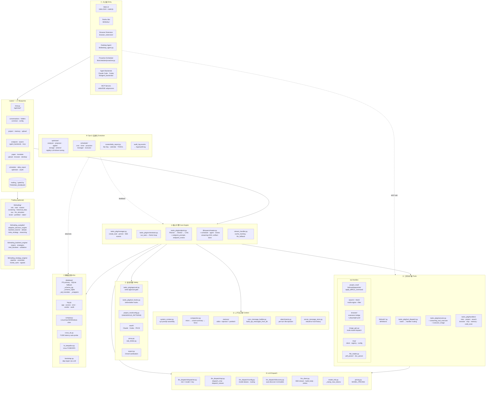

# Tofu (豆腐) — Architecture Panorama

> Canonical, up-to-date layered map of the project. Used as the source for
> `docs/architecture.html` (visual diagram) and whenever an AI assistant
> needs a birds-eye view.
>
> **Last re-scanned:** 2026-05-09 against `lib/`, `routes/`, `static/js/`,
> `server.py`, `routes/__init__.py`.
> **VERSION:** 0.9.4

---

## 1. Five-layer mental model

Tofu maps cleanly onto the same five layers Claude Code popularised
(Entry / Core / Safety / Context / Tools) plus an **Infra** layer that
covers logging, DB, OAuth, cross-DC, etc. and an **Ops** layer for the
nightly optimiser / scheduler.

```
┌─────────────────────────────────────────────────────────────────────┐
│                        ① Entry Layer                                │
│   Web UI (index.html)  │  Feishu Bot  │  Proactive Scheduler        │
│   Browser Extension    │  Desktop Agent│  MCP sub-process (stdio)   │
│   CLI backends (Claude Code / Codex) via agent_backends             │
└─────────────────────────────────────────────────────────────────────┘
                                │
                                ▼
┌─────────────────────────────────────────────────────────────────────┐
│                        ② Core Engine                                │
│   routes/chat.py → tasks_pkg.manager.create_task()                  │
│   tasks_pkg.orchestrator.run_task()  ←  main ReAct loop             │
│   tasks_pkg.endpoint.run_endpoint_task()  ←  Planner→Worker→Critic  │
│   lib/swarm/master.py  ←  multi-agent DAG                           │
│   SSE stream: append_event() → /api/chat/stream/<task_id>           │
└─────────────────────────────────────────────────────────────────────┘
                                │
                                ▼
┌─────────────────────────────────────────────────────────────────────┐
│         ③ Safety / Policy  ·  ④ Context Engineering                 │
│  project_mod.config.DANGEROUS_PATTERNS   │  system_context.py        │
│  tasks_pkg.approval (write approval)     │  compaction.py (3-layer)  │
│  oauth/ (Claude/Codex PKCE)              │  memory/ (skills, inject) │
│  proxy.py / rate_limiter.py              │  conv_message_builder.py  │
│  export.py (3-level sanitisation)        │  attachments.py           │
└─────────────────────────────────────────────────────────────────────┘
                                │
                                ▼
┌─────────────────────────────────────────────────────────────────────┐
│                        ⑤ Tools & Extensions                         │
│  lib/tools/*.py (definitions)  →  tasks_pkg.tool_dispatch           │
│                                 →  tasks_pkg.executor               │
│                                 →  tasks_pkg.handlers/*.py          │
│  Built-in: project / search / fetch / browser / code_exec /         │
│            emit_to_user / image_gen / memory / conversation /       │
│            human_guidance / meta(plan) / deferral                   │
│  External: MCP (mcp/), Swarm agents, Desktop tools                  │
└─────────────────────────────────────────────────────────────────────┘
                                │
                                ▼
┌─────────────────────────────────────────────────────────────────────┐
│              ⑥ LLM Dispatch  ·  ⑦ Infra  ·  ⑧ Ops                   │
│  llm_dispatch/ (slot × model × key) + llm_client.py (SSE, retry)    │
│  database/ (PG primary, SQLite fallback, dual schema)               │
│  log.py (app/access/error/vendor/audit)                             │
│  scheduler/ (cron, timer, proactive)                                │
│  optimizer/ (nightly self-tuning loop)                              │
│  cross_dc.py  ·  fs_keepalive.py  ·  compat.py                      │
└─────────────────────────────────────────────────────────────────────┘
```

---

## 2. Full Mermaid panorama

Paste into any Mermaid-aware renderer (GitHub, Typora, Obsidian).



---

## 3. Directory-level canonical list

Grounded against the current filesystem (2026-05-03).

### 3.1 Top level

| Path | Role |
|---|---|
| `server.py` (1674 L) | Flask app factory · middleware · tunnel auth · SSE werkzeug patch · auto-delegates to `bootstrap.py` on ImportError |
| `bootstrap.py` (2411 L) | LLM-guided dependency repair launcher with live browser status page |
| `export.py` (2359 L) | 3-level sanitising export (personal / internal / opensource) |
| `index.html` (3732 L) | Main SPA |
| `trading.html` (1068 L) | Trading SPA |
| `healthcheck.py` · `install.{py,sh,ps1}` | Install / health helpers |

### 3.2 `lib/` — core libraries (31 top-level modules + 22 sub-packages)

| Module / package | Purpose |
|---|---|
| `log.py` | `get_logger`, `log_context`, `log_exception`, `audit_log` |
| `llm_client.py` (3664 L) | SSE streaming, build_body, retries |
| `llm_dispatch/` | api · config · discovery · dispatcher · factory · slot (multi-key × multi-model) |
| `model_info.py` | `_clamp_max_tokens` per-model caps |
| `pricing.py` | MODEL_PRICING tables |
| `tools/` | **Definitions**: browser · code_exec · conversation · deferral · emit · human_guidance · image_gen · meta · project · search |
| `tasks_pkg/` | **Execution** (27 files): orchestrator · manager · executor · streaming_tool_executor · executor_image · tool_dispatch · tool_display · tool_hooks · endpoint · endpoint_prompts · endpoint_review · compaction · cache_tracking · llm_fallback · stream_handler · message_builder · conv_message_builder · server_message_store · system_context · model_config · attachments · approval · human_guidance · stdin_handler · **event_log** (durable SSE replay) · handlers/ |
| `tasks_pkg/handlers/` | misc · project · search · browser · mcp · memory · code_exec · _adapter |
| `project_mod/` | tools · read_tools · write_tools · scanner · indexer · modifications · config |
| `file_history/` | api · store — per-file copy-backup undo (replaces shadow-git shim) |
| `swarm/` (18 files) | master · agent · scheduler · planner · review · registry · rate_limiter · artifact_store · synthesis · integration · events · tools · types · messages · result_format · protocol · compat |
| `fetch/` | core · http · html_extract · pdf_extract · playwright_pool · content_filter · utils |
| `search/` | orchestrator · rerank · dedup · format · browser_fallback · engines/ |
| `browser/` | advanced · handlers · queue · dispatch · display · fetch |
| `agent_backends/` | builtin · claude_code · codex · detection · sse_bridge · session_store · protocol |
| `mcp/` | client · registry · config · project_names · types |
| `memory/` | storage · tools · injection · relevance · prefetch |
| `oauth/` | claude · codex · manager · pkce · token_store |
| `feishu/` | _state · conversation · messaging · pipeline · commands · events · startup |
| `scheduler/` | manager · executor · cron · timer · proactive · tool_defs · _shared |
| `pdf_parser/` | core · text · images · math · vlm · postprocess · _common |
| `optimizer/` | orchestrator · analyzer · proposer · applier · storage · actions/ (**nightly self-tuning**) |
| `database/` | _core · _bootstrap · _schema_pg · _schema_sqlite · _sql_translate · _wrappers |
| `trading/` (23 files) | info · intel · intel_mega_crawler · intel_timeline · market · screening · historical_data · nav · llm_simulator · news_apis · news_gathering · portfolio_analytics · simhash · sources · strategy_data · strategy_interface · backtest · brain/ · portfolio/ · radar/ |
| `trading_autopilot/` (14 files) | adaptive_decision_engine · backtest_learner · cycle · debate · kpi · meta_strategy · outcome · reasoning · strategy_evolution · strategy_learner · correlation · scheduler |
| `trading_backtest_engine/` | engine · strategies · intel_backtest · validation · reporting · analysis · comparison · config · state |
| `trading_strategy_engine/` | pipeline · strategy · signals · ensemble · monte_carlo · optimization · portfolio · risk_metrics |
| Top-level helpers | `compat.py` · `cross_dc.py` · `fs_keepalive.py` · `proxy.py` · `rate_limiter.py` · `config_dir.py` · `conv_ref.py` · `desktop_agent.py` · `desktop_tools.py` · `doc_parser.py` · `embeddings.py` · `file_reader.py` · `image_gen.py` · `js_bundler.py` · `key_stats.py` · `llm_error_format.py` · `message_queue.py` · `mt_provider.py` · `pptx_translator.py` · `protocols.py` · `trading_risk.py` · `trading_signals.py` · `trading_tasks.py` · `utils.py` · `version.py` |

### 3.3 `routes/` — Flask Blueprints (27 modules; 243 routes total)

**Core (always on):**
`common`, `config`, `conversations`, `upload`, `translate`, `chat`,
`project`, `memory`, `browser`, `desktop`, `scheduler`, `swarm`,
`endpoint`, `daily_report`, `oauth`, `agent_backends`, `folders`, `mcp`,
**`optimizer`**, `paper`.

**Trading (gated by `TRADING_ENABLED`):**
`trading_holdings`, `trading_intel`, `trading_decision`, `trading_autopilot`,
`trading_tasks`, `trading_brain`, `trading_simulator`.

### 3.4 `static/js/` — Vanilla-JS frontend (21 files, ~1.7M)

`core.js` · `main.js` · `ui.js` · `settings.js` · `branch.js` · `paper-reader.js` ·
`memory.js` · `project.js` · `scheduler.js` · `timer.js` · `image-gen.js` ·
`upload.js` · `translation.js` · `i18n.js` · `myday.js` · `optimizer.js` ·
`log-clean.js` · `export-images.js` · `idb-cache.js` · `trading/*.js` · `bundle-*.js`

### 3.5 `data/`, `logs/`, `docs/` (runtime & docs)

- `data/config/server_config.json` · `features.json` · `daily_reports/`
  (**per-project** isolated; no `~/.chatui/` global state)
- `logs/` — app · access · error · vendor · audit
- `docs/` — `DEVELOPMENT_DIRECTION.md` · `refactor_*.md` · `SECURITY_AUDIT_REPORT.md` ·
  `agentic-development-experience.md` · `CLAUDE_CODE_ALIGNMENT.md` ·
  `omc-claude-code-backport-analysis.md` · **this file** (`ARCHITECTURE.md`)

---

## 4. Request → Response walk-through

Helps when explaining Tofu in a talk / diagram legend.

1. **Browser** sends `POST /api/chat/send` (atomic: msg + translate + start task).
2. `routes/chat.py::chat_send()` persists the user message, calls
   `_start_task_for_conv()` → `tasks_pkg/conv_message_builder.py::build_api_messages_from_db()`.
3. `manager.create_task()` stores the task in memory + registers conv→task latest.
4. Background thread runs `orchestrator.run_task()`:
   - `system_context._inject_system_contexts()` (system prompt, memory, attachments)
   - per round:
     - `llm_dispatch.api.dispatch_stream()` → `llm_dispatch.dispatcher` picks
       best **slot** (key × model) → `llm_client.stream_chat()` streams SSE.
     - `stream_handler.analyse_stream_result()` classifies finish reason /
       tool calls / retries; `llm_fallback` swaps model on failure.
     - `tool_dispatch.parse_tool_calls()` + `execute_tool_pipeline()` →
       `executor._execute_tool_one()` → per-family handler.
     - `cache_tracking` tracks prompt-cache breaks.
     - `compaction.run_compaction_pipeline()` compresses old turns when needed.
5. `append_event()` emits SSE to `/api/chat/stream/<task_id>` (polled by frontend).
   Every event is **also** persisted via `tasks_pkg/event_log.append_persistent_event()`
   into the `task_events` table — this is what makes Last-Event-ID resumption
   durable across `cleanup_old_tasks` and server restart. Successive deltas
   are coalesced into one row per ~250 ms window with the LAST event_id.
6. On completion, `persist_task_result()` writes to DB (PG → SQLite fallback),
   `message_queue.dispatch_next_queued()` kicks any queued next message.
7. **Endpoint mode**: same loop wrapped in `endpoint.run_endpoint_task()`
   with Planner / Worker / Critic phases and `MAX_REPLANS=3`.
8. **Swarm mode**: `routes/swarm.py` delegates to `swarm/master.py` which
   runs a streaming DAG of specialist agents via `swarm/scheduler.py`.

---

## 5. Drift-check protocol (for AI assistants)

When re-generating this file or the HTML companion:

```bash
# 1. Inventory
list_dir('lib'); list_dir('routes'); list_dir('static/js')
list_dir('lib/tasks_pkg'); list_dir('lib/swarm')

# 2. Count blueprints
grep_search(pattern='@.*_bp.route', path='routes', count_only=True)

# 3. Trace active ALL_BLUEPRINTS
read_files([{path: 'routes/__init__.py'}])

# 4. Confirm trading gate
grep_search(pattern='TRADING_ENABLED', path='lib/__init__.py')
```

If the inventory has changed (new package, new tasks_pkg module, new blueprint),
update both §3 of this file and the matching block in `docs/architecture.html`,
then bump the "Last re-scanned" line at the top.

---

## 6. Messages-as-Rows roadmap (sync foundation)

The conversation store has been migrating away from "single JSONB array,
two writers" toward "individually addressable rows, server-only writes".
The current shape is the bridge layer:

| Phase | Status | What landed |
|---|---|---|
| **0. Persisted SSE events** | ✅ 2026-05-09 | `task_events` table + `tasks_pkg/event_log.py`. `append_event` mirrors every event; SSE stream falls back to the table when the task is gone. Survives `cleanup_old_tasks` and server restart. |
| **1. Comprehensive checkpoint** | ✅ 2026-05-09 | `_sync_partial_to_conversation` is now CAS-retried and writes the full structural payload (toolRounds, modifiedFileList, _emitContent, _memoryPrefetch, gitSha, model). Page-reload mid-stream reconstructs the same UI. |
| **2. Stable per-message IDs** | ✅ 2026-05-09 | `_assign_message_ids()` backfills UUIDs onto every JSONB write site (save_conv, patch_message, partial sync, result sync). New `PATCH /api/conversations/<cid>/messages/by-id/<mid>` endpoint. `routes/translate.py` resolves by id first, then idx, then content. The "msg_idx N out of range" warning class is fixed. |
| **3. Frontend reads via id** | ⏳ partial | `_patchMessageOnServer` and `_startTranslateTask` send `msgId` when available; legacy `msgIdx` paths still work. Other call sites (edit, regenerate, branch) still index-based — to migrate. |
| **4. Stop frontend writes** | ⏳ planned | Remove `syncConversationToServer` PUT-with-messages-array path. Add `POST .../messages` for user-message creation. Backend becomes sole writer. Cross-talk autodedup heuristic deleted by construction. |
| **5. Per-message rows** | ⏳ planned | Drop the JSONB array; `messages` becomes its own table with `(conv_id, seq, _msgId)` and `tool_rounds JSONB`. `task_results` collapses into `messages.meta`. |

Phase 0–2 are shipped and reversible. Phase 3 is opt-in per call site
(absence of `_msgId` falls through to the legacy index path). Phase 4–5
require a coordinated backfill + frontend cutover and should ship as
their own PRs once Phase 3 is fully migrated.

**Why this order:** Phase 0 alone fixes the "tool list disappeared after
reconnect" complaints — the highest-frequency loss class — without
touching schema or frontend. Phase 1 fixes "page reload shows truncated
assistant message". Phase 2 fixes the index-out-of-range translate
warning *and* unblocks Phases 3–5, but requires no client cooperation
(every existing client keeps working through the legacy index path).

---

*Companion files: `docs/architecture.html` (visual panoramic diagram, use for
screenshots / slides / social posts), `CLAUDE.md §1` (terse overview that
points here), `README.md` (user-facing project tour).*
